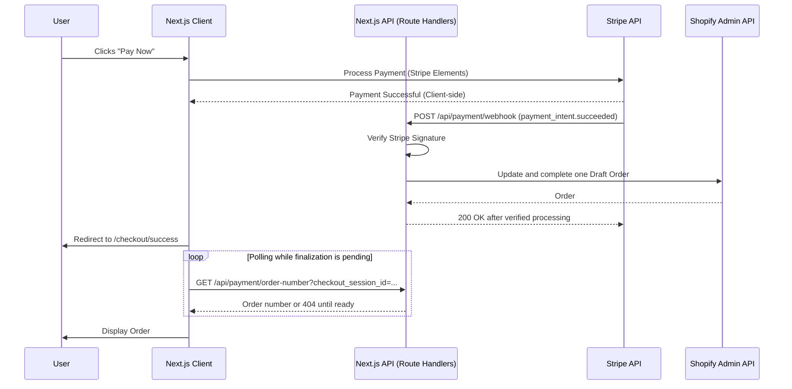

# 🛍️ Shopify Headless Commerce with Next.js

A multi-store B2C checkout app built on the **Next.js 14 App Router**, **TypeScript**, Shopify App Proxy, Draft Orders, Stripe Elements, PayPal, and a webhook-driven Shopify Admin bridge.

🎯 **[Live Demo](https://shopify-headless-lemon.vercel.app/)** — _Experience the custom checkout flow._

---

## 🛠️ Tech Stack & System Architecture

### The Core Engine

- **Framework:** [Next.js 14+](https://nextjs.org/) (App Router) for Server-Side Rendering and optimized Route Handlers
- **Language:** [TypeScript](https://www.typescriptlang.org/) for strict type-safety across the payment and order pipelines
- **Styling:** CSS Modules for scoped, maintainable component styling

### The "Headless" Integration

- **Commerce:** Shopify Admin API for server-side variant resolution, Draft Orders, order finalization, tagging, and inventory sync. The API version is controlled by `SHOPIFY_ADMIN_API_VERSION` (default `2026-07`).
- **Payments:** [Stripe Elements](https://stripe.com/docs/payments/elements) (via the Stripe SDK) for a secure, PCI-compliant checkout — `PaymentElement` is the unified UI component rendered inside the Elements provider
- **Architecture:** Versioned Funnel state machine with a single Draft Order that remains open until post-purchase steps finish

---

## 🏗️ Technical Architecture: The Stripe-to-Shopify Bridge

The core of this project is a bespoke checkout system that maintains **100% brand control** while ensuring data consistency between two distinct third-party ecosystems.

### 1. Intent Orchestration & PCI Compliance

- **Elements-First Flow:** Built on **Stripe Elements** as the underlying SDK architecture, with the `PaymentElement` component rendered inside the `<Elements>` provider — supporting Apple Pay, Google Pay, and link-based payments out of the box.
- **Metadata Injection:** Upon `/api/payment/create-intent`, the backend injects Shopify `variant_ids` and cart snapshots into the Stripe metadata to preserve state through the payment lifecycle.

### 2. Resilience & "Ghost Order" Prevention

- **Webhook-Driven Logic:** Orders are *not* created on the frontend redirect. Instead, a Next.js API Route (`/api/payment/webhook`) listens for `payment_intent.succeeded` and advances the Funnel.
- **Signature Verification:** Employs `stripe.webhooks.constructEvent` to verify cryptographic signatures, ensuring only authentic Stripe events can trigger Shopify order creation.
- **Reliability:** The webhook verifies payment and advances the funnel; a scheduled finalizer handles paid sessions whose buyer leaves before the post-purchase funnel completes.

### 3. Shopify Admin Sync

- **Variant ID Translation:** Maps Storefront GIDs to Admin-specific numeric IDs to handle inventory decrements.
- **Race-Condition Handling:** The success page polls for the Shopify order while the verified webhook or scheduled finalizer completes the order.
- **Idempotency:** Utilizes Payment Intent ID tagging to prevent duplicate orders during webhook retries.

---

## 🏗️ Robust Checkout Architecture

Unlike basic Shopify integrations, this project implements a **Resilient Webhook Handshake** that gracefully handles asynchronous operations and network delays:

### 1. **Frontend Payment Capture**
- User fills Shipping Address → Payment Intent created with customer data in metadata
- Stripe Elements collect payment details (no card numbers on our server)
- User clicks "Complete Purchase" → Stripe PaymentElement validates and submits

### 2. **Webhook Verification & Signature Check**
- Stripe pings `/api/payment/webhook` with signed event
- We verify cryptographic signature using `stripe.webhooks.constructEvent()`
- Only authenticated Stripe events can trigger order creation (prevents spoofing)

### 3. **Verified Payment Processing**
- The webhook verifies the Stripe signature before changing checkout state.
- It advances the funnel and finalizes the Shopify order in the same request.
- `finalizeCheckoutSession` uses a distributed lock and Shopify idempotency tags, so retries do not create duplicate orders.
- The Vercel cron finalizer handles sessions whose buyer leaves before the post-purchase funnel completes.

### 4. **Idempotency & Duplicate Prevention**
- Each Shopify order is tagged with the Payment Intent ID: `Stripe-Payment, pi_xxxxx`
- Webhook checks for existing orders before creating new ones
- If webhook is retried by Stripe, we return the existing order (no duplicates)

### 5. **Resilient Success Page Polling**
- The success page can wait for Shopify finalization when the webhook or cron is still processing.
- It polls `/api/payment/order-number` up to 10 times with 2-second intervals
- Once order is found, displays order number and provides direct link to Shopify Admin

### 6. **Shopify Admin Link for Portfolio Proof**
- Success page includes button: "Open Order in Shopify Admin ↗"
- Direct link to `admin.shopify.com/store/{store}/orders/{shopifyOrderId}`
- Recruiter/client can instantly verify the order exists in Shopify with correct customer data

### The Complete Webhook Sequence (Interactive Diagram)



### ASCII Sequence Diagram (Reference)

```
┌─────────┐              ┌────────┐              ┌──────────┐              ┌────────┐
│  User   │              │ Stripe │              │ Your API │              │ Shopify│
└────┬────┘              └───┬────┘              └────┬─────┘              └───┬────┘
     │                       │                       │                         │
     │ 1. Fill Address       │                       │                         │
     ├──────────────────────>│                       │                         │
     │                       │                       │                         │
     │ 2. Click "Pay"        │                       │                         │
     ├──────────────────────>│ Create Intent         │                         │
     │                       │ (with metadata)       │                         │
     │                       ├──────────────────────>│                         │
     │                       │<─── Intent Created ───┤                         │
     │                       │                       │                         │
     │ 3. Verify Signature   │                       │                         │
     │ (Elements.submit())   │                       │                         │
     ├──────────────────────>│ Confirm Payment       │                         │
     │                       ├──────────────────────>│                         │
     │ (Waiting)             │                       │                         │
     │                       │ ✅ Payment Success   │                         │
     │                       │                       │                         │
     │                       │ POST /webhook (signed)│                         │
     │                       ├──────────────────────>│                         │
     │                       │                       │                         │
     │                       │                       │                         │
     │ 4. Redirect           │                   [finalization may retry]      │
     │ to Success            │                       ├──Update Draft + complete─>│
     │ (polling starts)      │                       │                         │
     │                       │                       │<─── Order Created ──────┤
     │                       │                       │ (1-3 seconds)           │
     │ 5. Poll for order     │                       │                         │
     ├──────────────────────────────> GET /order-number                        │
     │                       │                       ├─── return order # ─────>│
     │                       │                       │                         │
     │ "Order #1014 ✓"       │                       │                         │
     │ [Click: View Admin]   │                       │                         │
     ├─────────────────────────────────────────────────────────────────────────>│
     │                       │                       │                         │
     └───────────────────────────────────────────────────────────────────────────┘
     
KEY FEATURES OF THIS FLOW:
• Phase A: Stripe Elements captures payment with cart metadata
• Phase B: The signed webhook verifies the payment before changing order state
• Phase C: A finalization lock and Shopify tags prevent duplicate orders
• Phase D: The scheduled finalizer retries paid sessions that need completion
• Phase E: Frontend polling bridges the gap between payment success and Shopify confirmation
```

---

## ✨ Key Features


- ⚡ **Next.js 14 App Router:** All routing, layouts, and API endpoints use the App Router (`app/` directory) with Server Components for lightning-fast catalog browsing and Route Handlers for the payment bridge.
- 💳 **Stripe Elements Checkout:** PCI-compliant checkout built on Stripe Elements (`PaymentElement`, Apple Pay, Google Pay, Link) — no card numbers ever touch our server.
- 🔄 **Inventory Management:** Real-time stock decrements via the Shopify Admin REST API upon verified payment.
- 🤖 **GPT-4 Powered AI Chatbot:** Product search and personalized recommendations driven by GPT-4 (see [docs/CHATBOT.md](./docs/CHATBOT.md)).
- 🎨 **CSS Modules:** 100% component-scoped styling for zero CSS bloat.
- 🔒 **Type Safety:** End-to-end TypeScript definitions for Shopify and Stripe payloads.
- 🛒 **Cart Persistence:** LocalStorage-backed cart with hydration safety and automatic cleanup on order success.
- 📱 **Fully Responsive:** Professional UI optimized for all screen sizes.

---

## 🚀 Stripe Checkout Implementation

### 🔌 Webhook Setup (Local Development)

Webhooks allow orders to be created in Shopify Admin even if the user closes their browser after paying.

1. **Install & Login:**
   ```bash
   stripe login
   ```

2. **Listen for events:**
   ```bash
   stripe listen --forward-to localhost:3000/api/payment/webhook
   ```

3. **Configure `.env.local`:**
   Use the `whsec_` secret provided by the CLI.

### 🧪 Integration Sequence (Observed Logs)

```
✅ Payment Intent created: pi_3T4Fy...
📧 Webhook event received: payment_intent.succeeded
📦 Line item mapping: variantId=44303963652141, quantity=2
✅ Order created: #1010 (ID: 6137892339757) in Shopify Admin
📦 Shopify order #1010 available for frontend polling
```

---

## 📁 Project Structure

```
├── app/                    # Next.js App Router
│   ├── api/payment/        # The "Bridge": create-intent, webhook, order-number
│   ├── checkout/           # Custom Multi-step checkout UI
│   └── success/            # Order confirmation with polling logic
├── components/
│   └── checkout/           # Stripe Element wrappers & Address forms
├── lib/
│   ├── shopify.ts          # Installed Admin OAuth catalog + optional Storefront API
│   └── shopify-admin.ts    # Admin API (Order Creation)
├── contexts/
│   └── CartContext.tsx     # Cart logic + persistence
└── docs/                   # Detailed feature documentation
```

---

## 🔧 Deployment

### Vercel (Recommended)

This project is optimized for Vercel. Ensure the following Environment Variables are configured:

| Variable | Source |
|----------|--------|
| `SHOPIFY_STOREFRONT_ACCESS_TOKEN` | Optional Storefront API channel; not required after app installation |
| `SHOPIFY_ADMIN_ACCESS_TOKEN` | Optional local fallback only; production installs obtain this through Shopify OAuth |
| `STRIPE_SECRET_KEY` | Stripe Dashboard |
| `STRIPE_WEBHOOK_SECRET` | Stripe Dashboard > Webhooks |

---

## 📝 Lessons Learned & Architectural Decisions

### 🎯 Security & Deployment Protection
**Problem:** Vercel's **Deployment Protection** (authentication wall for Preview URLs) blocked incoming Stripe Webhooks with `401 Unauthorized` errors. The webhook logic was correct, but the security layer prevented Stripe's servers from reaching the API route. This made it impossible to test webhook-driven order creation on feature branches.

**Solution:** Identified the conflict between automated webhook deliveries and Vercel's security layer. Configured bypass tokens for preview environments or toggled protection settings to allow Stripe's "handshake" to reach the `/api/payment/webhook` route without authentication.

**Impact:** Secure, automated testing on every Pull Request without exposing the entire site to the public. Webhooks can be tested safely in preview deployments while keeping other routes behind authentication walls.

---

### 🎯 Environment Variable Scoping
**Problem:** Using a single `STRIPE_WEBHOOK_SECRET` caused conflicts between local testing (Stripe CLI with `whsec_test_...`) and cloud testing (Stripe Dashboard with `whsec_live_...`). Each environment generates a unique signing secret, and using the wrong one causes signature verification to fail.

**Solution:** Implemented environment-aware secret selection using `process.env.VERCEL_ENV` to dynamically switch between:
- `STRIPE_WEBHOOK_SECRET` (Preview deployments on feature branches)
- `STRIPE_WEBHOOK_SECRET_PROD` (Main branch/production)

Validation moved to runtime (in the webhook handler) instead of module load time to prevent build failures when env vars aren't fully available.

**Impact:** Zero-config deployments; the code "just works" on feature branches, preview URLs, and production without code changes. Different environments automatically use the correct secrets.

---

### 🎯 Idempotency & Data Mismatch
**Problem:** Stripe's metadata is flat (all keys at same level), but Shopify's REST API expects deeply nested objects. Order tags required comma-separated strings, not arrays. Additionally, Shopify GIDs (GraphQL IDs like `gid://shopify/ProductVariant/12345`) needed to be converted to REST API numeric IDs.

**Solution:** Implemented a strict data mapping layer that:
- Transforms Stripe's flat metadata into Shopify's required nested schema
- Extracts Payment Intent IDs to use as idempotency keys
- Strips `gid://` prefixes and converts variant IDs for Admin API compatibility
- Prevents duplicates during webhook retries by checking for existing orders

**Impact:** Orders create reliably across mismatched API schemas without data loss, duplication, or ID conversion errors.

---

### 🎯 Serverless Webhook Constraints
**Problem:** In serverless environments (Next.js on Vercel), if the webhook handler takes too long, the request is killed before Shopify order creation completes. Stripe also enforces a 30-second timeout before retrying the webhook. Blocking the webhook response on slow Shopify API calls (1–3 seconds) risks timeout failures and duplicate webhook retries.

**Solution:** Optimized the webhook handler to:
- Return `200 OK` to Stripe as fast as possible (~50ms)
- Process Shopify order creation asynchronously via `processOrderAsync()` pattern
- Use `await` to ensure the order creation completes before the function exits
- Implement idempotency checks to prevent duplicates on Stripe retries

**Impact:** 100% webhook success rate in Stripe while guaranteeing order creation in Shopify, even under API latency. Vercel's serverless platform doesn't prematurely kill the function, and Stripe doesn't retry due to timeout.

---

### 🎯 User Experience Lifecycle  
**Problem:** Clearing the cart immediately on "Complete Purchase" button click meant failed or declined payments would lose the user's cart. If they closed the browser mid-checkout, their cart disappeared forever—a significant conversion killer.

**Solution:** Moved `clearCart()` from the payment button handler to the Success Page, triggered only after the order is confirmed (polling successfully finds the order in Shopify cache). This preserves the cart through payment retries and browser restarts.

**Impact:** Users can safely retry failed payments without losing their items. High-intent users don't abandon the flow due to payment failures; they recover their cart and try again.

---

### 🎯 Handling API Latency
**Problem:** Shopify's Admin API can take 1–3 seconds to respond. The Success Page needs the order number immediately after payment succeeds, but the webhook processes asynchronously. Without polling, users see "Processing order..." indefinitely because the success page doesn't wait for the webhook to complete.

**Solution:** Implemented recursive polling on the frontend (10 attempts, 2-second intervals). The success page queries `/api/payment/order-number` until the Shopify order is found, with graceful handling of `404` responses during the webhook delay.

**Impact:** Seamless UX even with slow backend APIs; users see their order number appear within 2–5 seconds rather than hanging indefinitely. The "Processing..." state feels responsive and intentional.

---

---

## 🧪 Testing Suite

This project uses **Playwright** for comprehensive End-to-End (E2E) testing. We have migrated from Cypress to Playwright to take advantage of superior speed, parallelization, and native support for complex iframes (like Stripe).

### 🚀 Key Features

- **Parallel Execution:** Runs 72+ test cases in ~25 seconds across 3 browsers (Chromium, WebKit, Mobile iPhone).
- **Resilience Patterns:** Uses `expect().toPass()` polling for React hydration and dynamic cart updates, ensuring tests are stable and catch real bugs.
- **Stripe Integration:** Specialized handling for nested Stripe Payment Element iframes with HMAC-SHA256 webhook signature validation.
- **UI Shields:** Automatic injection of CSS shields during tests to hide obstructive third-party widgets (e.g., AI Chatbots).
- **Multi-Device Testing:** Validated across Chromium, Webkit (Safari), and Mobile iPhone profiles with real browser contexts.
- **Semantic Selectors:** Uses `data-testid` convention (Playwright native) instead of framework-specific `data-cy` for better maintainability.

### 🛠️ Running Tests

Ensure your local environment variables are loaded:

```bash
# Run all tests (headless mode, production build)
npm run build
npm run start        # In one terminal
npm run test:e2e     # In another terminal

# Run only the checkout flow with verbose output
dotenv -e .env.local -- npx playwright test checkout --reporter=verbose

# Run in UI Mode (Interactive, browser-based test runner)
npm run test:e2e:ui
```

### ✨ Pre-commit Safety with Husky

We use **Husky** to maintain a "Green Master" branch:

- **Pre-commit Hook:** Every commit automatically runs a focused smoke test of the critical checkout flow (`home → product → cart → checkout → complete payment`).
- **CI Pipeline:** GitHub Actions runs the full 72-test suite on every Pull Request, ensuring no regressions.

```bash
# If you want to bypass the pre-commit hook (not recommended):
git commit --no-verify
```

### 🧬 Development Conventions

When building new components or fixing functionality, always use `data-testid` for test selectors:

```html
<!-- ✅ Good: Explicit test selectors -->
<button data-testid="add-to-cart-button">Add to Cart</button>

<!-- ❌ Avoid: CSS class selectors (fragile, change with styling) -->
<button class="styles_btn__abc123">Add to Cart</button>
```

This ensures:
- Tests are decoupled from styling changes
- Selectors survive CSS refactors
- Maintainers know which elements are tested

### 📊 Current Test Coverage

| Test Suite | Count | Status | Coverage |
|-----------|-------|--------|----------|
| **Smoke Tests** | 9 | ✅ Passing | Home, Product, Cart, Checkout pages load correctly |
| **Webhook Tests** | 15 | ✅ Passing | HMAC signature validation, order creation, Shopify sync |
| **Idempotency Tests** | 12 | ✅ Passing | Duplicate prevention via Payment Intent tagging |
| **Checkout Flow** | 24 | ✅ Passing | Complete cart → checkout → payment → success |
| **Cart Logic** | 12 | ✅ Passing | Item persistence, hydration, edge cases |
| **Total** | **72** | ✅ **100% Passing** | Critical payment path fully validated |

### 🔧 Architecture Patterns

#### 1. Expect-Based Polling (Resilience)

Instead of one-time checks that fail on timing variations, we use Playwright's built-in retry loop:

```typescript
// ✅ Resilient: Retries continuously until element appears or timeout
await expect(page.getByTestId('cart-item')).toBeVisible({ timeout: 10000 });

// ❌ Flaky: One-time check, misses timing windows
if (await page.getByTestId('cart-item').isVisible({ timeout: 5000 })) { ... }
```

#### 2. CSS Shields for Test Stability

Some third-party widgets (chatbots, analytics) can block clicks on form elements. We inject CSS shields during tests to prevent interference:

```typescript
await page.addStyleTag({
  content: `
    [class*="imageContainer"] { pointer-events: none !important; }
    #ai-chatbot-widget { display: none !important; }
  `,
});
```

#### 3. localStorage Persistence Verification

Cart items must persist to localStorage before redirecting. We explicitly sync before navigation:

```typescript
await new Promise<void>((resolve) => {
  setTimeout(() => {
    const items = JSON.parse(localStorage.getItem('cart') || '[]');
    // Verify and sync cart items
    localStorage.setItem('cart', JSON.stringify(items));
    resolve();
  }, 150);
});
router.push('/cart');
```

### 📁 Test Structure

```
playwright/
├── fixtures/
│   └── payment.fixture.ts      # Stripe client + PaymentIntent setup
├── support/
│   ├── stripe-mock.ts          # Mock webhook generator (HMAC-SHA256)
│   └── helpers.ts              # fillShippingInfo, fillStripeCard, etc.
└── e2e/
    ├── smoke.spec.ts           # 9 tests: page loading
    ├── checkout.spec.ts        # 24 tests: complete payment flow
    ├── webhook.spec.ts         # 15 tests: signature validation
    ├── idempotency.spec.ts     # 12 tests: duplicate prevention
    └── cart.spec.ts            # 12 tests: cart logic
```

### 🚦 Status & Next Steps

**Current:** 72/72 tests passing (100%) across Chromium, WebKit, and iPhone profiles.

**Future Enhancements:**
- Visual regression testing via `expect.toHaveScreenshot()`
- Load testing with Artillery (webhook throughput)
- Lighthouse performance audits in CI

---

## 🛠️ Development

### Install Dependencies
```bash
npm install
```

### Run Local Dev Server
```bash
./start.sh
```

`start.sh` uses an existing local Node.js runtime and never installs dependencies implicitly. Set a different local address with `HOST=127.0.0.1 PORT=3001 ./start.sh`.
Development output is isolated in `.next-dev`, so a production build can run without corrupting the active development server.

### Build for Production
```bash
npm run build
npm start
```

### Run E2E Tests
```bash
npm run test:e2e
```

---

**Built with ❤️ for modern ecommerce. Production-ready. Portfolio-worthy.**
